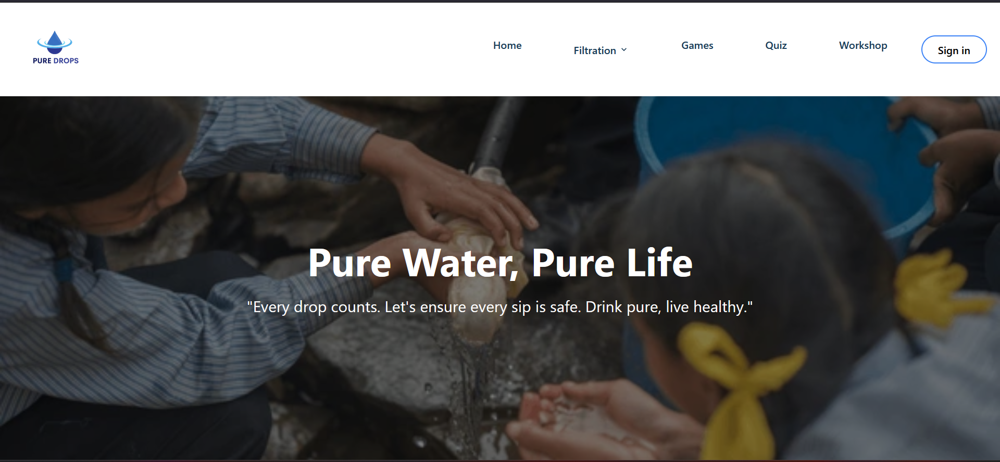
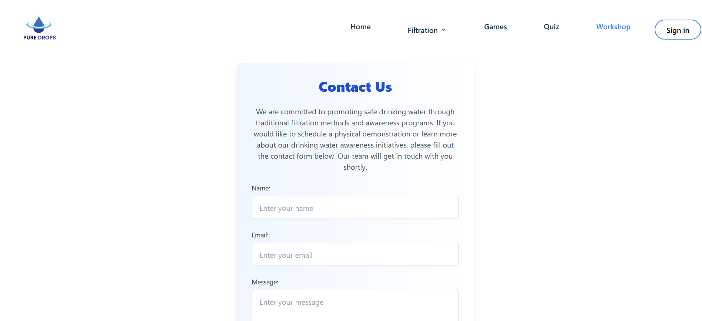

# Pure Drops - Safe Drinking Water App

## Introduction

Pure Drops is an educational app designed to teach children about safe drinking water practices. Developed in just 3 days during the WLIT Hackathon, this app combines interactive games, quizzes, and detailed guides on traditional water filtration methods to provide a fun and informative learning experience.

## Features

- _Interactive Learning:_ Engaging games and quizzes to help children learn about water safety.
- _Educational Content:_ Step-by-step guides on traditional water filtration methods.
- _Workshop Requests:_ Schools, clubs, and organizations can request workshops on safe drinking water practices.

## Tech Stack

- _Frontend:_ React, Tailwind CSS
- _Backend:_ Node.js, Express.js, MongoDB

## Usage

Explore the various features, including games, quizzes, educational content, and the workshop request form, to learn more about safe drinking water practices and how to implement traditional filtration methods.

## Acknowledgments

A big thank you to the wlit for providing this opportunity and to all our amazing team members for their hard work and dedication.

